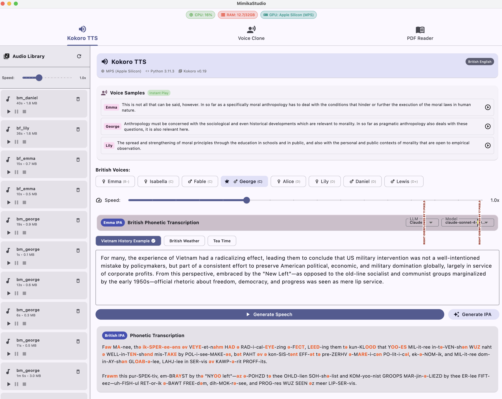
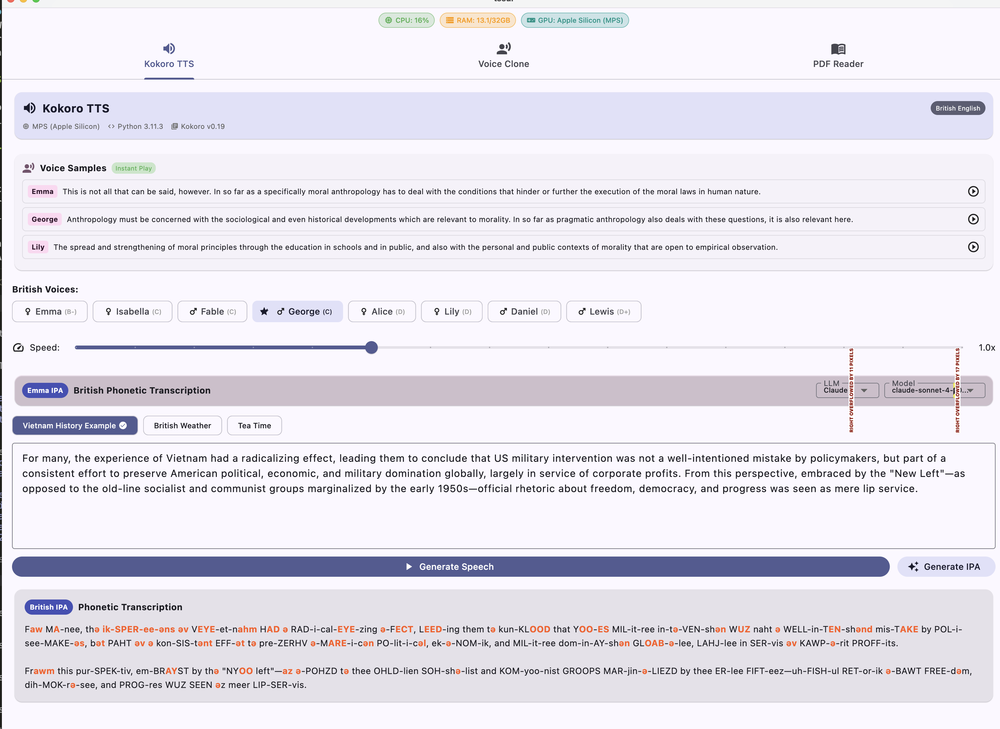
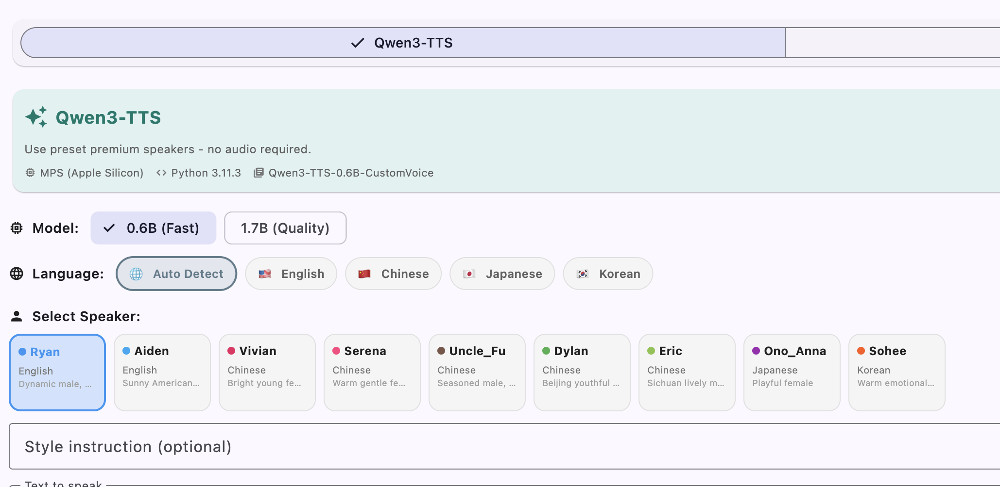
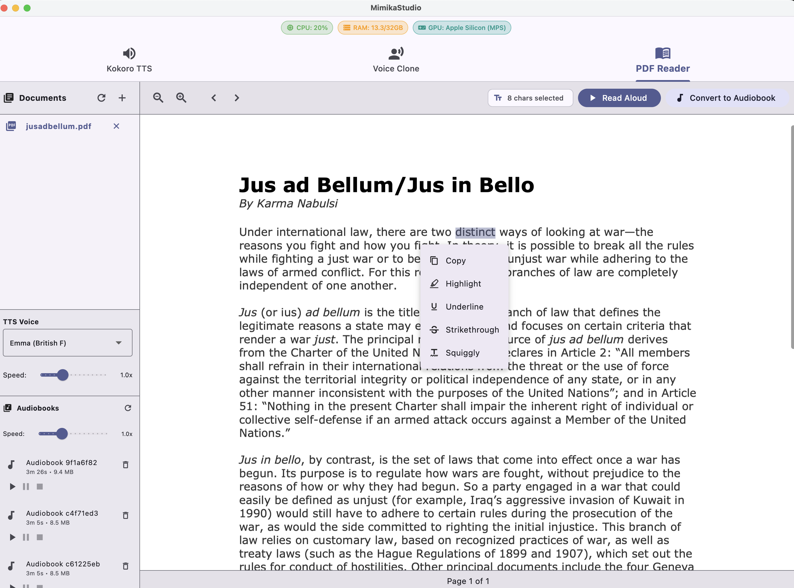
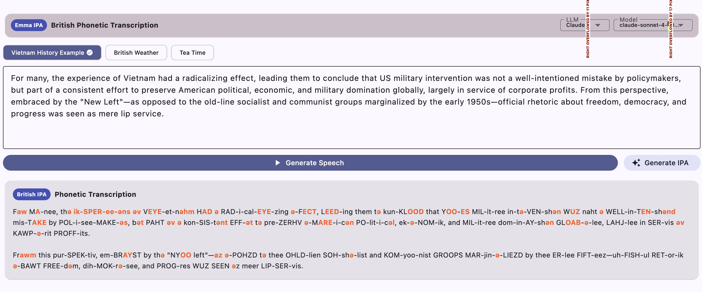
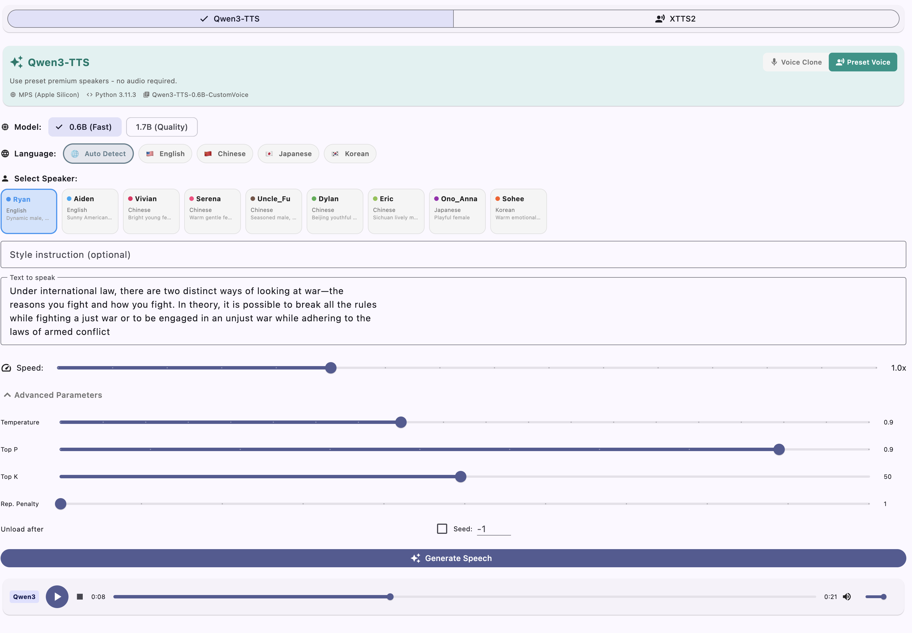
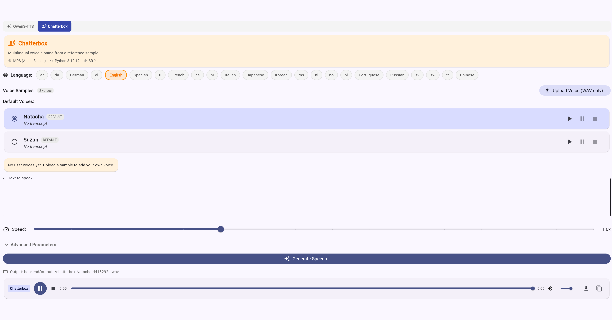
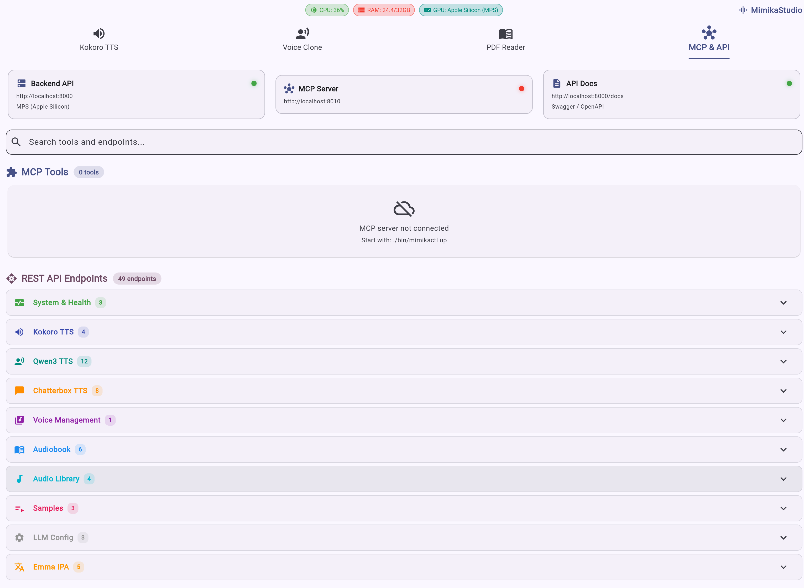

<div align="center">
  
  <br>
</div>

# MimikaStudio - Voice Cloning, TTS & Audiobook Creator (macOS + Web)

> **MimikaStudio is the most comprehensive desktop application for voice cloning and text-to-speech synthesis.**

> **Custom Voice Cloning** | **Text-to-Speech** | **PDF Read Aloud** | **Audiobook Creator** | **MCP & API Dashboard**

A local-first desktop application with four core capabilities: **clone any voice** from just 3 seconds of audio, generate **high-quality text-to-speech** with multiple engines and premium voices, **read PDFs aloud** with sentence-by-sentence highlighting, and **convert documents to audiobooks** with your choice of voice.

### Supported Models

| Model | Parameters | Type | Languages |
|-------|-----------|------|-----------|
| [Kokoro-82M](https://github.com/hexgrad/kokoro) | 82M | Fast TTS | English (British RP + American) |
| [Qwen3-TTS 0.6B Base](https://github.com/QwenLM/Qwen3-TTS) | 600M | Voice Cloning | 10 languages |
| [Qwen3-TTS 1.7B Base](https://github.com/QwenLM/Qwen3-TTS) | 1.7B | Voice Cloning | 10 languages |
| [Qwen3-TTS 0.6B CustomVoice](https://github.com/QwenLM/Qwen3-TTS) | 600M | Preset Speakers | 4 languages (en, zh, ja, ko) |
| [Qwen3-TTS 1.7B CustomVoice](https://github.com/QwenLM/Qwen3-TTS) | 1.7B | Preset Speakers | 4 languages (en, zh, ja, ko) |
| [Chatterbox Multilingual](https://github.com/resemble-ai/chatterbox) | — | Voice Cloning | 23 languages |



---

## Installation

### System Requirements

| Component | Requirement |
|-----------|-------------|
| **OS** | macOS 12+ (Monterey or later) |
| **CPU** | Apple Silicon (M1/M2/M3/M4) or Intel |
| **RAM** | 8GB minimum, 16GB+ recommended |
| **Storage** | 10GB for models and dependencies |
| **Python** | 3.10 or later |
| **Flutter** | 3.x with macOS desktop support (optional, for GUI) |

### Automated Install (Recommended)

A single `install.sh` in the project root handles everything: prerequisites,
virtual environment, all Python dependencies (including Qwen3-TTS, Chatterbox,
OmegaConf, Perth, etc.), database setup, and Flutter.

```bash
git clone https://github.com/BoltzmannEntropy/MimikaStudio.git
cd MimikaStudio
./install.sh
```

The script will:
1. Check / install Homebrew, Python 3, espeak-ng, and ffmpeg
2. Create a Python venv in the project root (`./venv`)
3. Install **all** Python dependencies from the root `requirements.txt`
4. Install `chatterbox-tts` with `--no-deps` (its runtime deps are already in `requirements.txt`)
5. Verify that every critical import works
6. Initialize the SQLite database
7. Set up Flutter (if installed)

After installation, start MimikaStudio:

```bash
source venv/bin/activate
./bin/mimikactl up          # Backend + MCP + Flutter desktop
./bin/mimikactl up --web    # Backend + MCP + Flutter web UI
```

### Manual Install

```bash
git clone https://github.com/BoltzmannEntropy/MimikaStudio.git
cd MimikaStudio

# System dependencies (macOS)
brew install espeak-ng ffmpeg python@3.11

# Python venv
python3 -m venv venv
source venv/bin/activate
pip install --upgrade pip

# All Python dependencies (from project root)
pip install -r requirements.txt

# Chatterbox TTS (--no-deps to avoid version conflicts with its strict pins)
pip install --no-deps chatterbox-tts==0.1.6

# Initialize database
cd backend && python3 database.py && cd ..

# Flutter (optional, for desktop/web UI)
cd flutter_app && flutter pub get && cd ..

# Start
./bin/mimikactl up
```

### Download Models (Optional)

Models auto-download on first use (~3 GB total). To pre-download:

```bash
./bin/mimikactl models download kokoro   # ~300 MB
./bin/mimikactl models download qwen3    # ~4 GB for 1.7B
```

### Verify Installation

```bash
source venv/bin/activate
python -c "import kokoro; print('Kokoro OK')"
python -c "from qwen_tts import QwenTTS; print('Qwen3-TTS OK')"
python -c "from chatterbox import ChatterboxTTS; print('Chatterbox OK')"
python -c "import omegaconf; print('OmegaConf OK')"
python -c "import perth; print('Perth OK')"
```

---

## Quick Start

```bash
# Start all services (Backend + MCP + Flutter UI)
./bin/mimikactl up

# Or: Backend + MCP + Flutter Web UI
./bin/mimikactl up --web
# Then open http://127.0.0.1:5173

# Or: Backend + MCP only (no Flutter)
./bin/mimikactl up --no-flutter

# Check status
./bin/mimikactl status

# View logs
./bin/mimikactl logs backend
```

Example startup output:
```
=== Starting MimikaStudio ===
Starting backend...
Waiting for http://localhost:8000/api/health ...... OK
Starting MCP Server...
MCP Server started on port 8010
Starting Flutter UI (dev mode)...
```

---

## Platforms

MimikaStudio ships two UIs backed by the same local FastAPI server:

**macOS Desktop App** (default): `./bin/mimikactl up`

**Web UI** (Flutter Web): `./bin/mimikactl up --web` then open http://127.0.0.1:5173

> The web UI uses the same backend and voice library as the desktop app.
> In web mode, use **Open Document** to upload PDFs from your machine.

---

## Why MimikaStudio?

MimikaStudio brings together the latest advances in neural text-to-speech into a unified desktop experience.

### Lightning-Fast British TTS with Kokoro

**[Kokoro TTS](https://github.com/hexgrad/kokoro)** delivers sub-200ms latency with crystal-clear British and American accents. The 82M parameter model runs effortlessly on any machine, generating natural-sounding speech with Emma, George, Lily, and other premium voices.

Kokoro also includes **Emma IPA** - a British phonetic transcription tool powered by your choice of LLM (Claude, OpenAI, Ollama).



### Voice Cloning Without Limits

Clone any voice from remarkably short audio samples. **[Qwen3-TTS](https://github.com/QwenLM/Qwen3-TTS)** requires just **3 seconds** of reference audio to capture a speaker's characteristics. Upload a voice memo, a podcast clip, or any audio snippet, and MimikaStudio will synthesize new speech in that voice.

For multilingual cloning, **[Chatterbox Multilingual TTS](https://huggingface.co/spaces/ResembleAI/Chatterbox-Multilingual-TTS)** adds a second voice clone engine with its own voice library and controls.

### Premium Preset Speakers

MimikaStudio includes **9 premium preset speakers** across 4 languages (English, Chinese, Japanese, Korean), each with distinct personalities. These CustomVoice speakers require no audio samples at all.

### Multiple State-of-the-Art Models

| Model | Type | Strength |
|-------|------|----------|
| **[Kokoro-82M](https://github.com/hexgrad/kokoro)** | Fast TTS | Sub-200ms latency, British RP & American accents |
| **[Qwen3-TTS](https://github.com/QwenLM/Qwen3-TTS) 0.6B/1.7B Base** | Voice Cloning | 3-second cloning, 10 languages |
| **[Qwen3-TTS](https://github.com/QwenLM/Qwen3-TTS) 0.6B/1.7B CustomVoice** | Preset Speakers | 9 premium voices, style control |
| **[Chatterbox Multilingual TTS](https://huggingface.co/spaces/ResembleAI/Chatterbox-Multilingual-TTS)** | Voice Cloning | Multilingual cloning with prompt audio |



### Beyond Simple TTS

- **Emma IPA Transcription**: British IPA-like phonetic transcriptions using LLM providers (Claude, OpenAI, Ollama)
- **PDF Reader with Voice**: Read PDFs aloud with sentence-by-sentence highlighting
- **Audiobook Creator**: Convert documents (PDF, EPUB, TXT, MD, DOCX) into WAV/MP3/M4B audiobooks with smart chunking, crossfade merging, progress tracking, and chapter markers
- **Voice Library**: Manage Qwen3 + Chatterbox voice samples in a unified list
- **Advanced Generation Controls**: Temperature, top_p, top_k, repetition penalty, seed
- **Style Instructions**: Tell speakers *how* to speak - "whisper softly", "speak with excitement", etc.
- **Real-time System Monitoring**: CPU, RAM, and GPU usage in the app header
- **Multi-LLM Support**: Claude, OpenAI, Ollama (local), or Claude Code CLI



---

## Features

- **Qwen3-TTS Voice Clone**: Clone any voice from just 3+ seconds of audio
- **Qwen3-TTS Custom Voice**: 9 preset premium speakers (Ryan, Aiden, Vivian, Serena, Uncle Fu, Dylan, Eric, Ono Anna, Sohee)
- **Chatterbox Voice Clone**: Multilingual voice cloning with prompt audio
- **Advanced Generation Controls**: Temperature, top_p, top_k, repetition penalty, seed
- **Model Size Selection**: 0.6B (Fast) or 1.7B (Quality)
- **Kokoro TTS**: Fast, high-quality English synthesis with 21 British/American voices
- **Default Voice Samples**: Natasha and Suzan ship with the app; user uploads stored in `backend/data/user_voices/`
- **User Voices in UI**: Uploaded voices appear under **Voice Clone -> Your Voices** after restart/refresh
- **Voice Previews**: Tap play/pause/stop to audition voices before generating
- **Emma IPA**: British phonetic transcription with multi-LLM support (Claude, OpenAI, Ollama)
- **Document Reader**: Read PDFs, TXT, and MD files aloud with Kokoro TTS
- **Audiobook Creator**: Convert full documents to audiobook files (WAV/MP3/M4B) with smart chunking, crossfade merging, progress tracking, and playback controls
- **CLI Tool**: Full command-line interface for Kokoro and Qwen3
- **MCP & API Dashboard**: Built-in tab showing all MCP tools and REST endpoints with live server status
- **MCP Server**: Full MCP integration for programmatic access to all API endpoints
- **55 REST API endpoints** with FastAPI (auto-documented at `/docs`)

---

## Control Script (mimikactl)

```bash
# Service Commands
./bin/mimikactl up                    # Start all services
./bin/mimikactl up --no-flutter       # Backend + MCP only
./bin/mimikactl up --web              # Backend + MCP + Flutter Web UI
./bin/mimikactl down                  # Stop all services
./bin/mimikactl restart               # Restart all
./bin/mimikactl status                # Check status

# Backend Commands
./bin/mimikactl backend start         # Start backend only
./bin/mimikactl backend stop          # Stop backend

# Flutter Commands
./bin/mimikactl flutter start         # Start Flutter (release mode)
./bin/mimikactl flutter start --dev   # Start in dev mode
./bin/mimikactl flutter start --web   # Start Flutter Web UI
./bin/mimikactl flutter stop          # Stop Flutter
./bin/mimikactl flutter build         # Build macOS app

# MCP Server Commands
./bin/mimikactl mcp start             # Start MCP server (port 8010)
./bin/mimikactl mcp stop              # Stop MCP server
./bin/mimikactl mcp status            # Check MCP status

# Utility Commands
./bin/mimikactl logs [service]        # Tail logs (backend|mcp|flutter|all)
./bin/mimikactl test                  # Run API tests
./bin/mimikactl clean                 # Clean logs and temp files
./bin/mimikactl version               # Show version info
```

---

## CLI Tool (mimika)

Full command-line interface for voice cloning and TTS generation.

### Quick Examples

```bash
# Kokoro TTS (fast British/American voices)
./bin/mimika kokoro "Hello, world!" --voice bf_emma --output hello.wav
./bin/mimika kokoro input.txt --voice bm_george --speed 1.2

# Qwen3 Custom Voice (preset speakers)
./bin/mimika qwen3 "Hello, world!" --speaker Ryan --style "professional narration"
./bin/mimika qwen3 book.epub --speaker Sohee --output audiobook.wav

# Qwen3 Voice Clone (clone from reference audio)
./bin/mimika qwen3 "Hello, world!" --clone --reference Alina.wav
./bin/mimika qwen3 book.pdf --clone --reference Bella.wav --output book.wav

# List available voices
./bin/mimika voices --engine kokoro
./bin/mimika voices --engine qwen3
```

### Environment Variables

| Variable | Default | Description |
|----------|---------|-------------|
| `MIMIKA_API_URL` | `http://localhost:8000` | Backend API URL |

### `mimika kokoro` - Fast British/American TTS

```bash
./bin/mimika kokoro <input> [options]
```

| Parameter | Short | Default | Description |
|-----------|-------|---------|-------------|
| `input` | | *required* | Text string or file path (.txt, .pdf, .epub, .docx, .doc) |
| `--voice` | `-v` | `bf_emma` | Voice ID (see `mimika voices --engine kokoro`) |
| `--speed` | `-s` | `1.0` | Speech speed multiplier (0.5-2.0) |
| `--output` | `-o` | `<input>.wav` | Output WAV file path |

**Available Kokoro Voices:**

| Voice ID | Name | Gender | Accent |
|----------|------|--------|--------|
| `bf_emma` | Emma | Female | British RP |
| `bf_isabella` | Isabella | Female | British |
| `bf_alice` | Alice | Female | British |
| `bf_lily` | Lily | Female | British |
| `bm_george` | George | Male | British |
| `bm_lewis` | Lewis | Male | British |
| `bm_daniel` | Daniel | Male | British |
| `af_heart` | Heart | Female | American |
| `af_bella` | Bella | Female | American |
| `af_nicole` | Nicole | Female | American |
| `af_aoede` | Aoede | Female | American |
| `af_kore` | Kore | Female | American |
| `af_sarah` | Sarah | Female | American |
| `af_sky` | Sky | Female | American |
| `am_michael` | Michael | Male | American |
| `am_adam` | Adam | Male | American |
| `am_echo` | Echo | Male | American |
| `am_liam` | Liam | Male | American |
| `am_onyx` | Onyx | Male | American |
| `am_puck` | Puck | Male | American |
| `am_santa` | Santa | Male | American |

### `mimika qwen3` - Voice Clone & Custom Voice

```bash
./bin/mimika qwen3 <input> [options]
```

**Common Parameters:**

| Parameter | Short | Default | Description |
|-----------|-------|---------|-------------|
| `input` | | *required* | Text string or file path (.txt, .pdf, .epub, .docx, .doc) |
| `--output` | `-o` | `<input>.wav` | Output WAV file path |
| `--model` | `-m` | `1.7B` | Model size: `0.6B` (fast) or `1.7B` (quality) |
| `--language` | `-l` | `auto` | Language code (auto, en, zh, ja, ko, de, fr, ru, pt, es, it) |
| `--temperature` | | `0.9` | Generation randomness (0.1-2.0) |
| `--top-p` | | `0.9` | Nucleus sampling threshold (0.1-1.0) |
| `--top-k` | | `50` | Top-k sampling (1-100) |

**Custom Voice Mode (Preset Speakers):**

| Parameter | Short | Default | Description |
|-----------|-------|---------|-------------|
| `--speaker` | | `Ryan` | Preset speaker name |
| `--style` | | *see below* | Style instruction for voice |

Default style: `"Optimized for engaging, professional audiobook narration"`

**Available Preset Speakers:**

| Speaker | Language | Character |
|---------|----------|-----------|
| `Ryan` | English | Dynamic male, strong rhythm |
| `Aiden` | English | Sunny American male |
| `Vivian` | Chinese | Bright young female |
| `Serena` | Chinese | Warm gentle female |
| `Uncle_Fu` | Chinese | Seasoned male, mellow timbre |
| `Dylan` | Chinese | Beijing youthful male |
| `Eric` | Chinese | Sichuan lively male |
| `Ono_Anna` | Japanese | Playful female |
| `Sohee` | Korean | Warm emotional female |

**Voice Clone Mode:**

| Parameter | Short | Default | Description |
|-----------|-------|---------|-------------|
| `--clone` | | *flag* | Enable voice cloning mode |
| `--reference` | `-r` | *required* | Reference audio file (WAV, 3+ seconds) |
| `--reference-text` | | *optional* | Transcript of reference audio (improves quality) |

### `mimika voices` - List Available Voices

```bash
./bin/mimika voices [--engine kokoro|qwen3]
```

### Supported File Formats

| Format | Extension | Requirements |
|--------|-----------|--------------|
| Plain Text | `.txt` | Built-in |
| PDF | `.pdf` | `PyPDF2`, `pymupdf` |
| EPUB | `.epub` | `ebooklib`, `beautifulsoup4` |
| Word Document | `.docx` | `python-docx` |
| Legacy Word | `.doc` | `docx2txt` |
| Markdown | `.md` | Built-in |

All format dependencies are included in `requirements.txt`.

---

## TTS Engines

### Kokoro TTS + Emma IPA

Fast, high-quality British English synthesis (82M parameters, 24kHz) with integrated IPA transcription.

**Emma IPA** generates British phonetic transcriptions using your choice of LLM provider:
- **Claude** (Anthropic) - claude-sonnet-4, claude-opus-4, claude-haiku-3
- **OpenAI** - gpt-4, gpt-4-turbo, gpt-3.5-turbo
- **Ollama** (Local) - Any locally installed model
- **Claude Code CLI** - Use your local Claude CLI



### Qwen3-TTS

#### Voice Clone Mode (Base)

Clone any voice from just 3+ seconds of reference audio.

**Models**:
- `Qwen3-TTS-12Hz-0.6B-Base` - Fast, 1.4GB
- `Qwen3-TTS-12Hz-1.7B-Base` - Higher quality, 3.6GB

**Languages**: Chinese, English, Japanese, Korean, German, French, Russian, Portuguese, Spanish, Italian

**How It Works**:
1. Upload a 3+ second audio sample
2. (Optional) Provide transcript for better quality
3. Enter text to synthesize
4. Adjust generation parameters if needed
5. Generate!

#### Custom Voice Mode (Preset Speakers)

Use 9 premium preset speakers without any reference audio.

**Models**:
- `Qwen3-TTS-12Hz-0.6B-CustomVoice`
- `Qwen3-TTS-12Hz-1.7B-CustomVoice`

**Style Instructions**: Control tone with prompts like "Speak slowly", "Very happy", "Whisper", or use "Optimized for engaging, professional audiobook narration" for long-form content.

#### Advanced Parameters

| Parameter | Default | Range | Description |
|-----------|---------|-------|-------------|
| Temperature | 0.9 | 0.1-2.0 | Randomness in generation |
| Top P | 0.9 | 0.1-1.0 | Nucleus sampling threshold |
| Top K | 50 | 1-100 | Top-k sampling |
| Repetition Penalty | 1.0 | 1.0-2.0 | Reduce repetition |
| Seed | -1 | -1 or 0+ | Reproducible generation (-1=random) |



### Chatterbox Multilingual TTS

Chatterbox adds multilingual voice cloning from a reference audio prompt. It uses the same voice library flow as Qwen3 (default samples + your uploads).

**23 Supported Languages**:

| Code | Language | Code | Language | Code | Language |
|------|----------|------|----------|------|----------|
| ar | Arabic | he | Hebrew | no | Norwegian |
| da | Danish | hi | Hindi | pl | Polish |
| de | German | it | Italian | pt | Portuguese |
| el | Greek | ja | Japanese | ru | Russian |
| en | English | ko | Korean | sv | Swedish |
| es | Spanish | ms | Malay | sw | Swahili |
| fi | Finnish | nl | Dutch | tr | Turkish |
| fr | French | | | zh | Chinese |

**Parameters**:
- Temperature (randomness)
- CFG weight (conditioning strength)
- Exaggeration (style intensity)
- Seed (reproducibility)

**Note**: On Apple Silicon, Chatterbox runs on CPU due to MPS resampling limitations.



---

## API Reference

The backend exposes 55 REST endpoints via FastAPI. Full interactive docs at **http://localhost:8000/docs**.

### System

| Endpoint | Method | Description |
|----------|--------|-------------|
| `/api/health` | GET | Health check |
| `/api/system/info` | GET | System information (Python, device, models, OS) |
| `/api/system/stats` | GET | Real-time CPU/RAM/GPU usage |

### Kokoro TTS

| Endpoint | Method | Description |
|----------|--------|-------------|
| `/api/kokoro/generate` | POST | Generate speech with Kokoro |
| `/api/kokoro/voices` | GET | List available voices |
| `/api/kokoro/audio/list` | GET | List generated audio files |
| `/api/kokoro/audio/{filename}` | DELETE | Delete audio file |

### Qwen3-TTS

| Endpoint | Method | Description |
|----------|--------|-------------|
| `/api/qwen3/generate` | POST | Generate audio (clone or custom mode) |
| `/api/qwen3/generate/stream` | POST | Streaming audio generation |
| `/api/qwen3/voices` | GET | List saved voice samples |
| `/api/qwen3/voices` | POST | Upload new voice sample |
| `/api/qwen3/voices/{name}` | PUT | Update voice sample |
| `/api/qwen3/voices/{name}` | DELETE | Delete voice sample |
| `/api/qwen3/voices/{name}/audio` | GET | Preview voice sample audio |
| `/api/qwen3/speakers` | GET | List 9 preset speakers |
| `/api/qwen3/models` | GET | List available models |
| `/api/qwen3/languages` | GET | List supported languages |
| `/api/qwen3/info` | GET | Model info and status |
| `/api/qwen3/clear-cache` | POST | Clear voice prompt cache |

### Chatterbox TTS

| Endpoint | Method | Description |
|----------|--------|-------------|
| `/api/chatterbox/generate` | POST | Generate speech (voice clone) |
| `/api/chatterbox/voices` | GET | List saved voice samples |
| `/api/chatterbox/voices` | POST | Upload new voice sample |
| `/api/chatterbox/voices/{name}` | PUT | Update voice sample |
| `/api/chatterbox/voices/{name}` | DELETE | Delete voice sample |
| `/api/chatterbox/voices/{name}/audio` | GET | Preview voice sample audio |
| `/api/chatterbox/languages` | GET | List supported languages |
| `/api/chatterbox/info` | GET | Model info |

### Unified Voices

| Endpoint | Method | Description |
|----------|--------|-------------|
| `/api/voices/custom` | GET | All custom voices across all engines |

### Audiobook Creator

| Endpoint | Method | Description |
|----------|--------|-------------|
| `/api/audiobook/generate` | POST | Start audiobook generation from text |
| `/api/audiobook/generate-from-file` | POST | Generate from uploaded file (PDF/EPUB/TXT/DOCX) |
| `/api/audiobook/status/{job_id}` | GET | Job progress (chars/sec, ETA, chapters) |
| `/api/audiobook/cancel/{job_id}` | POST | Cancel in-progress job |
| `/api/audiobook/list` | GET | List generated audiobooks |
| `/api/audiobook/{job_id}` | DELETE | Delete audiobook file |

**Performance**: ~60 chars/sec on M2 MacBook Pro CPU.

**Output Formats**: WAV (lossless), MP3 (compressed), M4B (audiobook with chapter markers).

**Subtitle Formats**: SRT (VLC-compatible), VTT (web-compatible).

### Audio Library

| Endpoint | Method | Description |
|----------|--------|-------------|
| `/api/tts/audio/list` | GET | List Kokoro-generated audio |
| `/api/tts/audio/{filename}` | DELETE | Delete TTS audio file |
| `/api/voice-clone/audio/list` | GET | List Qwen3/Chatterbox clone audio |
| `/api/voice-clone/audio/{filename}` | DELETE | Delete clone audio file |

### Emma IPA

| Endpoint | Method | Description |
|----------|--------|-------------|
| `/api/ipa/sample` | GET | Default sample text |
| `/api/ipa/samples` | GET | All saved IPA samples |
| `/api/ipa/generate` | POST | Generate British IPA transcription |
| `/api/ipa/pregenerated` | GET | Pregenerated IPA with audio |
| `/api/ipa/save-output` | POST | Save IPA output to history |

### LLM Configuration

| Endpoint | Method | Description |
|----------|--------|-------------|
| `/api/llm/config` | GET | Current LLM config |
| `/api/llm/config` | POST | Update LLM provider settings |
| `/api/llm/ollama/models` | GET | List local Ollama models |

### Samples & Pregenerated Content

| Endpoint | Method | Description |
|----------|--------|-------------|
| `/api/samples/{engine}` | GET | Sample texts for engine |
| `/api/pregenerated` | GET | Pregenerated audio samples |
| `/api/voice-samples` | GET | Voice sample sentences with audio |

### Audiobook Generation Example

```bash
# Start generation
curl -X POST http://localhost:8000/api/audiobook/generate \
  -H "Content-Type: application/json" \
  -d '{"text": "Your document text...", "title": "My Audiobook", "voice": "bf_emma", "output_format": "m4b"}'

# From file
curl -X POST http://localhost:8000/api/audiobook/generate-from-file \
  -F "file=@mybook.pdf" -F "title=My Audiobook" -F "voice=bf_emma" -F "output_format=m4b"

# Poll progress
curl http://localhost:8000/api/audiobook/status/{job_id}
```

---

## MCP Server

MimikaStudio includes a full MCP (Model Context Protocol) server that exposes every API endpoint as MCP tools for programmatic access via Claude Code CLI, Codex, or any MCP-compatible client.

**Start:** `./bin/mimikactl mcp start` (port 8010)

The MCP server provides 47 tools for:
- TTS generation (Kokoro, Qwen3, Chatterbox)
- Voice management (list, upload, delete, update, preview)
- Audiobook generation and management
- System info and monitoring
- LLM configuration
- IPA transcription
- Audio library management

### MCP & API Dashboard (In-App)

The **MCP & API** tab in the Flutter app provides a live dashboard showing:

- **Server status** — Backend API (port 8000), MCP Server (port 8010), and API Docs availability with green/red indicators
- **All 47 MCP tools** grouped by category (System, Kokoro, Qwen3, Chatterbox, Audiobook, Voice Management, Samples, LLM, IPA) with expandable parameter details
- **All 55 REST API endpoints** grouped by category with HTTP method badges (GET/POST/PUT/DELETE)
- **Search** — Filter tools and endpoints by name, path, or description

The dashboard fetches MCP tools live from the MCP server via JSON-RPC, so it always reflects the current tool set.



---

## Running Tests

```bash
source venv/bin/activate
cd backend

# Run all tests (fast, no model loading required)
pytest tests/ -v

# Run specific test file
pytest tests/test_all_endpoints.py -v

# Run with actual model tests (slow, requires models downloaded)
RUN_MODEL_TESTS=1 pytest tests/
```

---

## Architecture

```
MimikaStudio/
├── install.sh                # Single install script (run this first)
├── requirements.txt          # All Python dependencies
├── venv/                     # Python virtual environment (created by install.sh)
│
├── bin/
│   ├── mimikactl             # Service control script
│   ├── mimika                # CLI tool for TTS/voice cloning
│   └── tts_mcp_server.py    # MCP server for programmatic access
│
├── pdf/                      # Place PDFs here for the PDF Reader
│
├── flutter_app/              # macOS Flutter desktop application
│   ├── lib/
│   │   ├── main.dart         # App entry, 4-tab navigation + MimikaStudio branding
│   │   ├── screens/
│   │   │   ├── quick_tts_screen.dart      # Kokoro TTS + Emma IPA
│   │   │   ├── voice_clone_screen.dart    # Qwen3 + Chatterbox voice clone
│   │   │   ├── pdf_reader_screen.dart     # PDF reader with TTS
│   │   │   └── mcp_endpoints_screen.dart  # MCP & API dashboard
│   │   └── services/
│   │       └── api_service.dart           # Backend API client
│   └── macos/                             # macOS configuration
│
├── backend/                  # FastAPI Python backend (55 endpoints)
│   ├── main.py              # API endpoints
│   ├── database.py          # SQLite initialization and seeding
│   ├── requirements.txt     # (legacy, use root requirements.txt)
│   ├── tts/                 # TTS engine wrappers
│   │   ├── kokoro_engine.py
│   │   ├── qwen3_engine.py  # Clone + CustomVoice
│   │   ├── chatterbox_engine.py # Multilingual voice clone
│   │   ├── text_chunking.py # Smart text chunking for audiobooks
│   │   ├── audio_utils.py   # Audio processing utilities
│   │   └── audiobook.py     # Audiobook generation logic
│   ├── language/
│   │   └── ipa_generator.py # British IPA transcription
│   ├── llm/                 # LLM provider integration
│   │   ├── factory.py       # Claude, OpenAI, Ollama support
│   │   ├── claude_provider.py
│   │   ├── openai_provider.py
│   │   └── codex_provider.py
│   ├── models/
│   │   └── registry.py      # Model registry
│   ├── tests/               # Comprehensive test suite
│   └── data/
│       ├── samples/         # Shipped voice samples
│       │   ├── qwen3_voices/      # Natasha, Suzan
│       │   ├── chatterbox_voices/ # Natasha, Suzan
│       │   └── kokoro/            # Pre-generated Kokoro samples
│       ├── user_voices/     # User uploads (git-ignored)
│       │   ├── qwen3/
│       │   └── chatterbox/
│       └── outputs/         # Generated audio files
│
└── scripts/                 # Additional scripts
    ├── install_macos.sh     # (legacy, use root install.sh)
    └── setup.sh             # (legacy, use root install.sh)
```

---

## Troubleshooting

### Common Issues

**"espeak-ng not found"**
```bash
brew install espeak-ng
```

**"ffmpeg not found" (for MP3/M4B export)**
```bash
brew install ffmpeg
```

**"No module named 'perth'" or "No module named 'omegaconf'"**

These are Chatterbox runtime dependencies. Run `./install.sh` or manually:
```bash
source venv/bin/activate
pip install resemble-perth omegaconf conformer diffusers pyloudnorm pykakasi spacy-pkuseg
pip install --no-deps chatterbox-tts==0.1.6
```

**"spaCy not available" (warning, not error)**
```bash
pip install spacy
# The app will use regex fallback if spaCy is not installed
```

**Models not downloading**
- Ensure you have internet access
- Models are stored in `~/.cache/huggingface/` (Qwen3) and `backend/models/` (Kokoro)

**Flutter build fails**
```bash
flutter clean && flutter pub get && flutter build macos --release
```

**Port 8000 already in use**
```bash
lsof -i :8000
kill -9 <PID>
```

### Performance Tips

- **Apple Silicon**: Qwen3-TTS runs on CPU; Kokoro uses MPS when available; Chatterbox runs on CPU
- **Audiobook generation**: Expect ~60 chars/sec on M2 MacBook Pro (matching audiblez benchmark)
- **Memory**: Close other apps when generating long audiobooks with 1.7B model

---

## Author

| | |
|---|---|
| **Author** | Shlomo Kashani |
| **Affiliation** | Johns Hopkins University, Maryland, U.S.A. |

---

## Citation

```bibtex
@software{kashani2025mimikastudio,
  title={MimikaStudio: Local-First Voice Cloning and Text-to-Speech Desktop Application},
  author={Kashani, Shlomo},
  year={2025},
  institution={Johns Hopkins University},
  url={https://github.com/BoltzmannEntropy/MimikaStudio},
  note={Comprehensive desktop application integrating Qwen3-TTS and Kokoro for voice cloning and synthesis}
}
```

**APA Format:**

Kashani, S. (2025). *MimikaStudio: Local-First Voice Cloning and Text-to-Speech Desktop Application*. Johns Hopkins University. https://github.com/BoltzmannEntropy/MimikaStudio

**IEEE Format:**

S. Kashani, "MimikaStudio: Local-First Voice Cloning and Text-to-Speech Desktop Application," Johns Hopkins University, 2025. [Online]. Available: https://github.com/BoltzmannEntropy/MimikaStudio

---

## Similar Projects

| Project | Description | Key Features |
|---------|-------------|--------------|
| [**audiblez**](https://github.com/santinic/audiblez) | EPUB to audiobook converter using Kokoro TTS | spaCy sentence tokenization, M4B output with chapters |
| [**pdf-narrator**](https://github.com/mateogon/pdf-narrator) | PDF to audiobook with smart text extraction | Skips headers/footers/page numbers, TOC-based chapter splitting |
| [**abogen**](https://github.com/denizsafak/abogen) | Full-featured audiobook generator GUI | Voice mixer, subtitle generation, batch processing |
| [**Qwen3-Audiobook-Converter**](https://github.com/WhiskeyCoder/Qwen3-Audiobook-Converter) | Qwen3-TTS audiobook tool | Style instructions for professional narration |

### What MimikaStudio Adds

- **From audiblez**: spaCy-based sentence tokenization, character-based progress tracking, M4B with chapters
- **From pdf-narrator**: Smart PDF extraction that skips headers/footers/page numbers, TOC-based chapters
- **From abogen**: Multiple output formats (WAV/MP3/M4B), real-time progress with ETA
- **Unique to MimikaStudio**: Native macOS Flutter UI, 3-second voice cloning, voice library management, Emma IPA transcription, full MCP server integration, 55 REST API endpoints, in-app MCP & API dashboard

---

## License

MIT License

## Acknowledgments

- [Qwen3-TTS](https://github.com/QwenLM/Qwen3-TTS) - 3-second voice cloning with CustomVoice
- [Kokoro TTS](https://github.com/hexgrad/kokoro) - Fast, high-quality English TTS
- [Chatterbox](https://github.com/resemble-ai/chatterbox) - Multilingual voice cloning
- [Flutter](https://flutter.dev) - Cross-platform UI framework
- [FastAPI](https://fastapi.tiangolo.com) - Python API framework
- [spaCy](https://spacy.io) - Industrial-strength NLP for sentence tokenization
- [PyMuPDF](https://pymupdf.readthedocs.io) - Smart PDF text extraction
